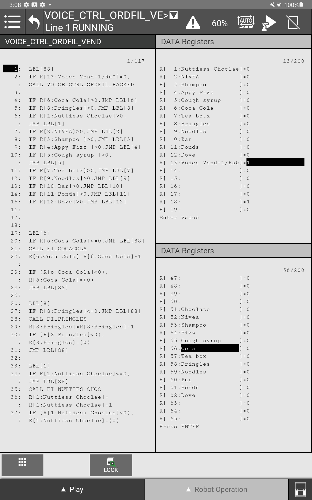
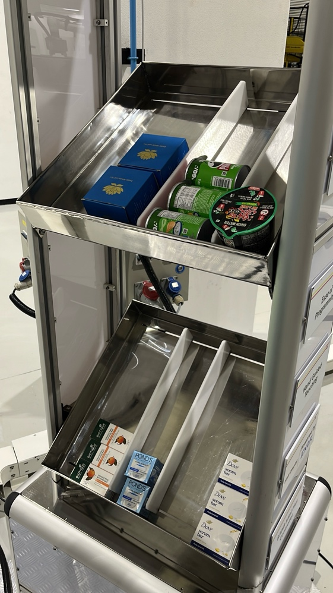
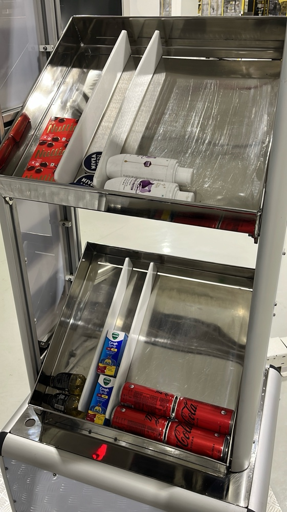
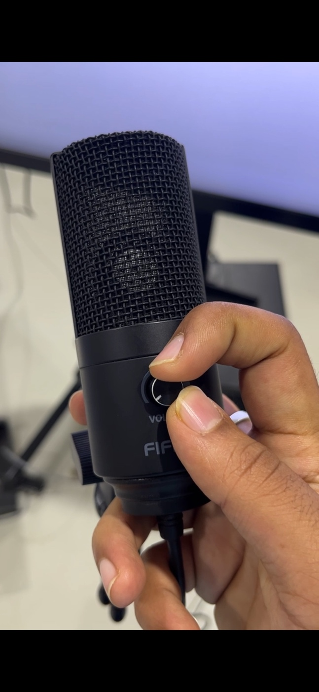
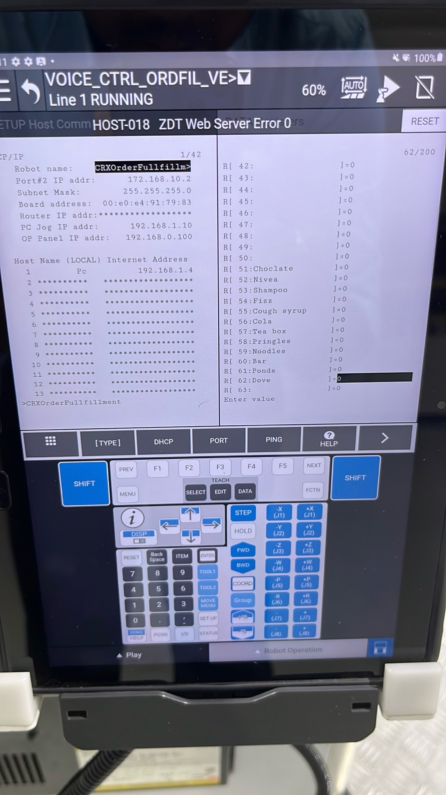
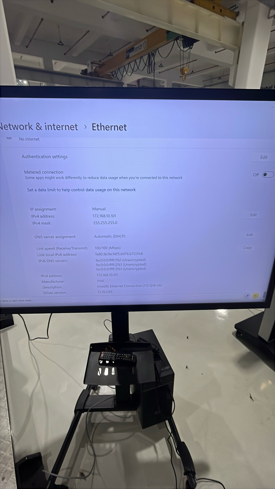
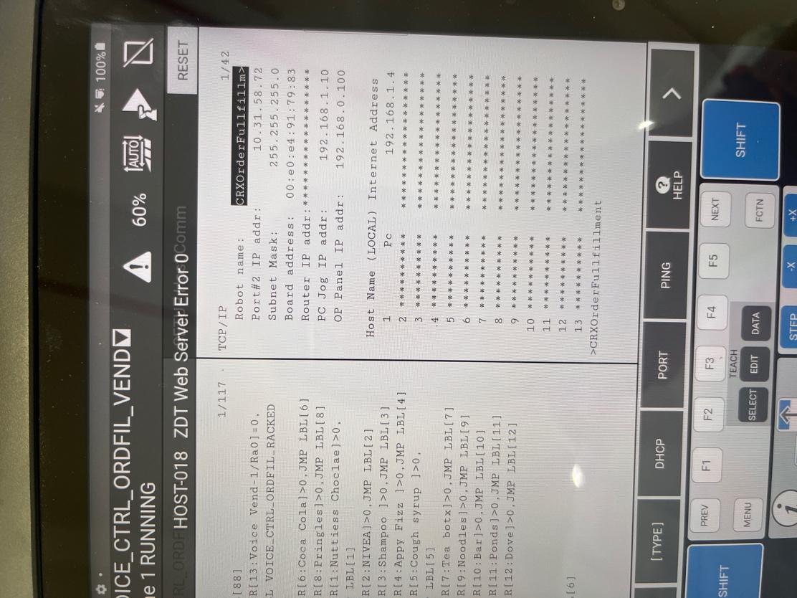

# FANUC LLM Voice-Controlled Order Fulfillment System

A comprehensive voice-controlled robotic order fulfillment solution powered by Large Language Models (LLM). This system enables natural language ordering and automated item management using FANUC collaborative robots integrated with OPC UA communication and AI-driven voice processing.

**Developed by:** FANUC India Pvt Ltd, Bangalore Tech Center  
**Initiative:** Physical AI Research & Development

---

## Overview

The FANUC Order Fulfillment Cell is an intelligent robotic system that combines:
- **Natural Language Processing** - Voice and text-based order input via LLM (Ollama)
- **Robotic Automation** - FANUC CRX robot control via OPC UA registers
- **Voice Recognition** - Real-time microphone input with gain tuning
- **Web Interface** - Browser-based control dashboard with real-time status monitoring
- **JSON Orchestration** - Cart state management and register synchronization

This system is designed for rapid item retrieval and organization tasks, with intuitive voice commands replacing traditional manual interfaces.

---

## Features

- **Voice Command Interface** - Control the robot entirely through natural speech
- **Text Input Alternative** - Type orders when voice is not available
- **Real-time Register Management** - Automatic synchronization with FANUC robot registers
- **Web Dashboard** - Monitor system status and send commands from any browser
- **JSON State Persistence** - Cart configuration saved to `current_cart.json`
- **Microphone Calibration Tool** - Built-in gain and threshold tuning utility
- **Multi-Modal Chat** - Terminal, voice, web UI, and hybrid modes
- **OPC UA Integration** - Direct communication with FANUC CRX robots  

---

## System Requirements

### Hardware
- **FANUC Collaborative Robot** (CRX series recommended) with OPC UA capability
- **Windows PC or Linux system** for control software
- **USB Microphone** with adjustable gain (for voice mode)
- **Google Chrome Browser** (recommended)
- **Display Monitor** for Teach Pendant and PC output

### Software
- Python 3.10 or newer
- Ollama (for LLM inference)
- A pulled Ollama model (`llama3:latest` recommended)
- Optional: FANUC robot with OPC UA enabled

### Network
- Robot IP: `172.168.10.2` (Mask: `255.255.255.0`)
- System IP: `172.168.10.101` (Mask: `255.255.255.0`)
- Direct network connectivity between robot and control PC

---

## Installation

### 1. Install Prerequisites

- Python 3.10 or newer
- [Ollama](https://ollama.ai) installed locally
- A pulled Ollama model:
  ```bash
  ollama pull llama3:latest
  ```

### 2. Clone and Setup Environment

```bash
# Navigate to the project directory
cd FANUC_Order_Fulfilment_Cell

# Create virtual environment
python3 -m venv .venv
source .venv/bin/activate  # On Windows: .venv\Scripts\activate

# Install dependencies
pip install -r requirements.txt
```

**Or use the bootstrap script:**
```bash
bash setup.sh  # Unix/Linux/macOS
# or
powershell -ExecutionPolicy Bypass -File setup.ps1  # Windows
```

### 3. Start Ollama Service

```bash
ollama serve
# In another terminal:
ollama pull llama3:latest
```

### 4. Verify Installation

```bash
python3 test_voice_integration.py
```

---

## System Architecture

### How It Works

The FANUC Order Fulfillment System operates through a multi-layered architecture designed for seamless communication between user input, AI processing, and robotic control:

**User Layer** receives commands through three channels: terminal text input, web browser UI, or voice commands via microphone. All user inputs are normalized and passed to the application layer.

**Application Layer** coordinates the entire workflow through the Master Controller, which routes requests to either the Frontend Backend (for web UI support), Voice Engine (for speech processing), or directly to the LLM Engine. This layer acts as the central orchestrator.

**LLM Processing Layer** (powered by Ollama Llama3) analyzes natural language input using precontext instructions to generate structured JSON responses. The LLM Engine translates user commands into actionable cart state updates.

**Robot Control Layer** receives JSON instructions and translates them into FANUC robot register updates via OPC UA. The Robot Handler manages register synchronization, maintains current cart state in `current_cart.json`, and communicates directly with the FANUC controller.

**Hardware Layer** executes the physical operations: the FANUC collaborative robot reads registers via OPC UA endpoint (port 4880) and performs item retrieval, placement, and organization tasks.


**Data Flow:**
- User commands enter through any interface (terminal, voice, web)
- Master Controller routes to appropriate processing engine
- LLM generates JSON cart operations
- Robot Handler converts JSON to register commands
- OPC UA sends commands to FANUC robot
- Robot state updates propagate back through the system

---

## Quick Start Guide

### Startup Procedure

#### 1. Power On Hardware

Turn on the robot and the PC with the display.

**Important:** Ensure that the PC is fully booted and running before executing any program on the Teach Pendant.

#### 2. Teach Pendant Setup

Ensure the robot has fully booted up and that the registers are properly initialized. All registers must be precisely arranged as described below before running any program.

##### Register Configuration

**Registers R[1] to R[12]:** Must all be zero at startup.



- These registers define the **order quantity** or the number of items brought from the rack to the cart by the robot.

**Register R[13]:** Set to 1 during startup.

- This register determines the robot's operation mode:
  - **R[13] = 1** → VEND mode (bring item from rack to cart) → Runs `VOICE_CTRL_ORDFIL_VEND`
  - **R[13] = 0** → RACK mode (place item from cart back to rack) → Runs `VOICE_CTRL_ORDFIL_RACKED`

**Registers R[51] to R[62]:** Must all be zero.

- These registers define which items will be placed back into the rack when `R[13] = 0`.
- Ensure all are zero during startup.

#### 3. Physical Setup

Before startup, ensure all items are properly positioned in their respective racks and oriented correctly.





**Program to Run:** Always execute `VOICE_CTRL_ORDFIL_VEND`

- Run in **Auto Mode**
- Set speed to **60% maximum** to prevent items from falling off the gripper

#### 4. PC Configuration

After the system has booted successfully:

1. Navigate to the cart configuration file:
   ```
   Desktop/New Development/FAUNC_LLM_Control2_ordfil/FANUC_LLM_Control2/Robot_handler/current_cart.json
   ```

2. Verify the JSON structure is initialized correctly for startup.

3. Open **Google Chrome** browser.

4. Locate and launch the application: **FANUC_Voice_OrderFil_OneClick**

   This application will:
   - Automatically run system health checks
   - Open the control dashboard as a local web application
   - Display real-time robot status and cart state

---

## Operating the System

### Text Mode (Terminal)

```bash
python3 master_terminal_chat.py
```

Interact with the robot via text commands in the terminal.

### Voice Mode

```bash
python3 master_terminal_chat.py --voice --voice-model tiny
```

#### Voice Control Setup

**Microphone Configuration:**

1. Ensure the USB microphone is properly connected.
2. Set the gain knob to **zero** before starting.

**Launching Voice Mode:**

1. Click the **microphone button** at the bottom right-hand corner of the interface.
2. Slowly increase the gain until the level indicator enters the **grey region**.
   - The knob does not need to be turned high.



3. Bring the microphone closer to your mouth.
4. Speak **clearly and deliberately** without rushing.
5. If the interpretation is incorrect, feel free to try again and discuss with the robot.

### Web Dashboard Mode

```bash
python3 master_terminal_chat.py --frontend
```

- Opens the browser interface at `http://127.0.0.1:5173`
- Use the **input field at the bottom** for text commands
- Click the **microphone icon** to enable voice control
- Monitor real-time status (ONLINE/OFFLINE, RUNNING/IDLE)

### Combined Mode (Voice + Web Dashboard)

```bash
python3 master_terminal_chat.py --voice --voice-model tiny --frontend
```

---

## Network and System Information

### Robot Connectivity

**Robot IP:** `172.168.10.2`  
**Network Mask:** `255.255.255.0`  



**System (Control PC) IP:** `172.168.10.101`  
**Network Mask:** `255.255.255.0`  



**Robot Status Before Voice Order Fulfillment:**



Note: Robot IP configuration may vary depending on your setup (e.g., ZDT environments).

---

## Advanced Configuration

### Microphone Tuning

Fine-tune microphone sensitivity and transcription thresholds:

```bash
python3 voice_engine/voice_tuner.py
```

Settings are automatically saved to `voice_settings.json` and will persist across restarts.

### Command-Line Options

#### `master_terminal_chat.py`

```
--voice                      Launch voice chat mode
--voice-model SIZE           Whisper model size (default: tiny)
--silence-threshold NUM      Amplitude threshold for silence detection
--silence-duration SECS      Seconds of silence before sending audio
--min-duration SECS          Minimum audio duration before transcription
--min-transcript-chars NUM   Minimum characters in transcript
--amplitude-accept-threshold NUM    Minimum RMS amplitude
--confidence-logprob-threshold NUM  Minimum average log probability
--use-wake-word              Enable wake-word detection (if supported)
--frontend                   Launch browser-based UI
--frontend-host HOST         Frontend bind host (default: 127.0.0.1)
--frontend-port PORT         Frontend HTTP port (default: 5173)
--backend-port PORT          WebSocket backend port (default: 9876)
```

#### `Robot_handler/robot_handler.py`

```
--watch                      Read JSON from robot_handler.pipe
--robot-ip IP                FANUC robot IP (default: 172.168.10.2)
--robot-port PORT            OPC UA port (default: 4880)
--pipe PATH                  Handler file path
--cart PATH                  Cart state file (default: current_cart.json)
```

---

## System Architecture

### Component Overview

| Component | Purpose | Location |
|-----------|---------|----------|
| **LLM Engine** | JSON order generation from natural language | `LLM_engine/` |
| **Robot Handler** | FANUC register write and cart state sync | `Robot_handler/` |
| **Voice Engine** | Microphone input and Whisper transcription | `voice_engine/` |
| **Frontend** | Browser-based control dashboard | `Fanuc-frontend/` |
| **Master Orchestrator** | Unified entry point for all modes | `master_terminal_chat.py` |

### Data Flow

```
[Voice/Text Input] 
    ↓
[LLM Engine - JSON Generation]
    ↓
[Robot Handler - Register Update]
    ↓
[FANUC Robot - Physical Action]
```

---

## Troubleshooting

### Ollama Not Running
**Error:** LLM engine fails to start  
**Solution:** Ensure `ollama serve` is running in a separate terminal

### Frontend Shows OFFLINE
**Error:** Browser UI displays OFFLINE status  
**Solution:** 
1. Reload the page
2. Verify the backend process is still running: `python3 fanuc_frontend_backend.py`

### Robot Disconnected
**Error:** Handler cannot connect to robot  
**Solution:**
1. Verify robot IP is correct: `172.168.10.2`
2. Check OPC UA port: `4880`
3. Confirm network connectivity: `ping 172.168.10.2`

### Voice Not Responding
**Error:** Voice mode shows no input detected  
**Solution:**
1. Confirm the voice button displays **VOICE ACTIVE**
2. Verify `faster-whisper` and `sounddevice` are installed:
   ```bash
   pip list | grep -E "faster-whisper|sounddevice"
   ```
3. Run microphone tuner: `python3 voice_engine/voice_tuner.py`

### Microphone Gain Issues
**Error:** Microphone input too loud or too quiet  
**Solution:**
1. Disconnect and reconnect the microphone
2. Adjust the physical gain knob on the microphone
3. Re-run the microphone tuner utility

---

## Project Structure

```
FANUC_Order_Fulfilment_Cell/
├── master_terminal_chat.py          # Main orchestrator
├── fanuc_frontend_backend.py        # WebSocket backend for UI
├── requirements.txt                 # Python dependencies
├── setup.sh / setup.ps1            # Installation scripts
├── LLM_engine/
│   ├── LLM_engine.py               # Ollama integration
│   ├── chat.py                     # Text chat interface
│   └── precontext.txt              # LLM system prompt
├── Robot_handler/
│   ├── robot_handler.py            # FANUC OPC UA interface
│   ├── fanuc_register_opcua.py     # Register definitions
│   └── current_cart.json           # Cart state
├── voice_engine/
│   ├── voice_chat.py               # Voice/text chat
│   ├── voice_tuner.py              # Microphone calibration
│   └── voice_settings.json         # Saved tuning config
├── Fanuc-frontend/                 # React web dashboard
└── images/                         # Documentation images
```

---

## Contributing & Support

For issues, feature requests, or documentation updates, please contact the development team or refer to INSTALL.md for detailed setup guidance.

---

## License

This project is proprietary. All rights reserved.

---

## About

**Organization:** FANUC India Pvt Ltd  
**Location:** Bangalore Technology Center  
**Initiative:** Physical AI Research & Development  
**Purpose:** Advanced robotic automation through natural language processing and AI-driven control systems

This project represents FANUC India's commitment to developing next-generation human-robot interaction technologies that bridge the gap between natural language communication and autonomous robotic systems.

---

**Last Updated:** 2026-07-13  
**System Version:** 1.0  
**Physical AI Initiative:** 2026

